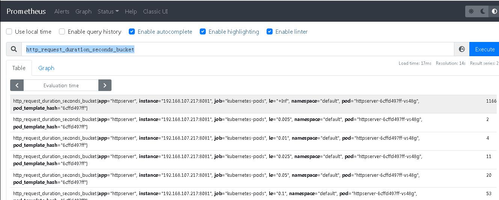

### httpserver应用改造
1、/healthz 添加 0-2 秒的随机延时 
```
	// 添加0-2s 随机时延，并计算http响应时延

	timeStart := time.Now()
	defer func() {
		http_request_duration_seconds.Observe(time.Since(timeStart).Seconds())
	}()

	delay := rand.Intn(2000)
	time.Sleep(time.Millisecond*time.Duration(delay))
	...
```
2、	定义Histogram类型的http_request_duration_seconds指标，并新增 /metrics
```
// 定义Histogram类型的http_request_duration_seconds指标
var (
	http_request_duration_seconds = promauto.NewHistogram(
        prometheus.HistogramOpts{
            Name:		"http_request_duration_seconds",
            Help:		"Histogram of lantencies for HTTP requests",
			Buckets:	[]float64{.1, .2, .4, 1, 3, 8, 20, 60, 120},
        },
    )
)

...

    // 新增 /metrics 路由
	mux.Handle("/metrics", promhttp.Handler())
```

### 部署lokistack
```sh
helm repo add grafana https://grafana.github.io/helm-charts

helm upgrade --install loki grafana/loki-stack --set grafana.enabled=true,prometheus.enabled=true,prometheus.alertmanager.persistentVolume.enabled=false,prometheus.server.persistentVolume.enabled=false
```

### 部署httpserver

annotations配置prometheus.io/port和prometheus.io/scrape
```yaml
...
template:
  metadata:
    annotations:
      prometheus.io/port: "8081"
      prometheus.io/scrape: "true"
    labels:
      app: httpserver
...
```

### Prometheus


<p align='center'>
</img>
</p>


### Grafana


